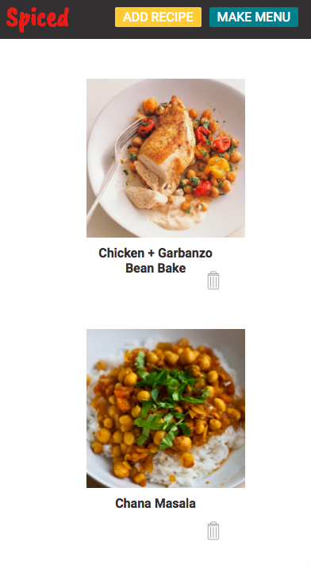
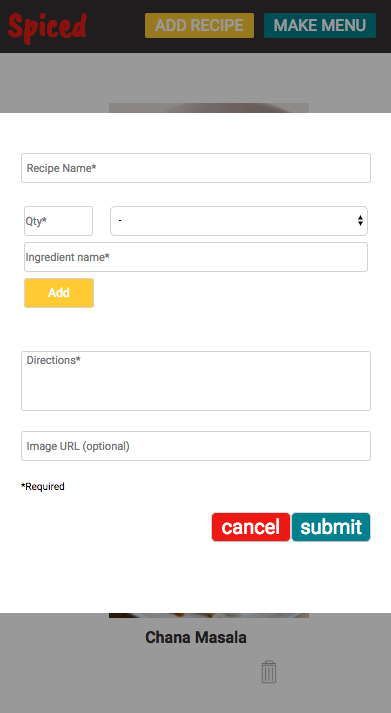
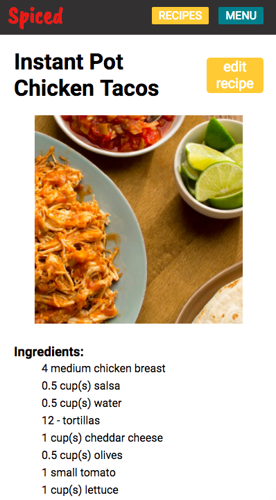
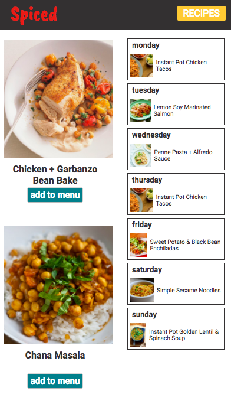

# Spiced

Amy Scoville

## Objective

Create a straightforward, user-friendly app for managing recipes and planning menus. Allow users to add, edit, and delete recipes, and to update the weekly menu. 

## Web Views

##### Main/Recipes Web View


#### Add Recipe Modal Web View


##### Individual Recipe Web View


##### Menu Web View


## Mobile Views

Main Mobile View | Add Recipe Mobile View | Individual Recipe Mobile View | Menu Mobile View
--- | --- | --- | ---
 |  |  | 


## Technologies Used
* Front End: HTML, CSS, JavaScript, React, Redux + Thunk
* Back End: Express, MongoDB, Mongoose

## Code Examples

The code below is the `render` function of the `IndvRecipe` component. The "edit recipe" button toggles an `editing` property on the local `state`, and conditionally renders either an edit form or an individual recipe based on the current value.

```render() {
        let { name, imgUrl, directions, ingredients } = this.props.recipe.data;
        let { loading } = this.props.recipe;
        let imgStyle = { backgroundImage: `url(${imgUrl})`, backgroundSize: "cover", backgroundPosition: "center" }
        if (this.state.editing) {
            return (
                <div className="edit-form-wrapper">
                    <Form toggle={this.toggleEdit}{...this.props.recipe.data} />
                </div>
            )
        }
        return (
            !loading ?
                <div>
                    <nav className="indv-recipe-nav"> <div className="spiced">Spiced</div> <div><Link to='/recipes' className="indv-recipe-nav-btn ">RECIPES</Link> <Link to="/buildmenu" className="indv-recipe-nav-btn indv-menu">MENU</Link></div></nav>
                    <div className="indv-recipe-wrapper">
                        <div className="indv-recipe-img" style={imgStyle}></div>
                        <div className="title-btn">
                            <h1 className="recipe-name-h4">{name}</h1>
                            <button className="edit-recipe-btn" onClick={this.toggleEdit}>edit recipe</button>
                        </div>
                        <div className="recipe-inf">
                            <h3>Ingredients:</h3>
                            <ul className="ing-ul">
                                {ingredients && ingredients.map((ingredient, index) => {
                                    return <li className="ing-li" key={index}>{`${ingredient.amount} ${ingredient.unit} ${ingredient.ingName}`}</li>
                                })}
                            </ul>
                            <h3 className="directions-header">Directions:</h3>
                            <p>{directions}</p>
                        </div>

                    </div>
                </div>
                :
                <div>LOADING</div>
        )
    }
}
```

## Future Ideas

* User authentication
* Self-populating grocery list based on menu items (editable)
* Send grocery list by e-mail
* Staples list from which user can select items to add to final shopping list
* Allow user to select number of weeks for menu planning


