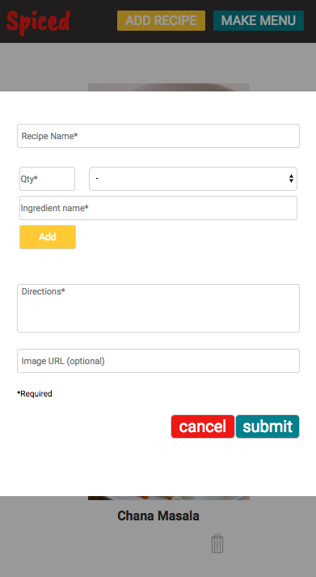

# Spiced

Amy Scoville

## Objective

Create a straightforward, user-friendly app for managing recipes and planning menus. Allow users to add, edit, and delete recipes, and to update the weekly menu. 

## Web Views

##### Main/Recipes Web View

#### Add Recipe Modal Web View

##### 

##### Menu Web View

## Mobile Views

Main Mobile View | Add Recipe Mobile View | Individual Recipe Mobile View | Menu Mobile View
--- | --- | --- | ---
 |  |  | 

